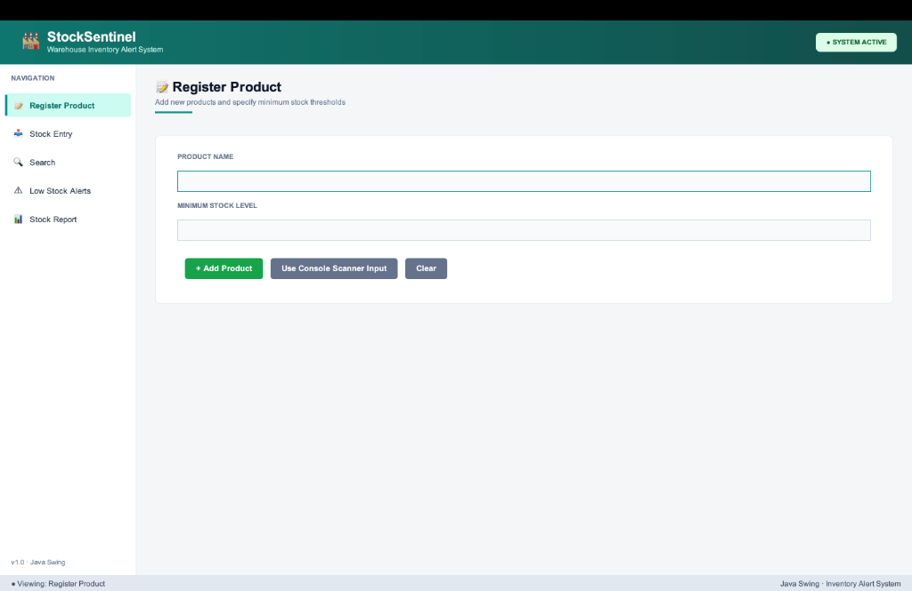
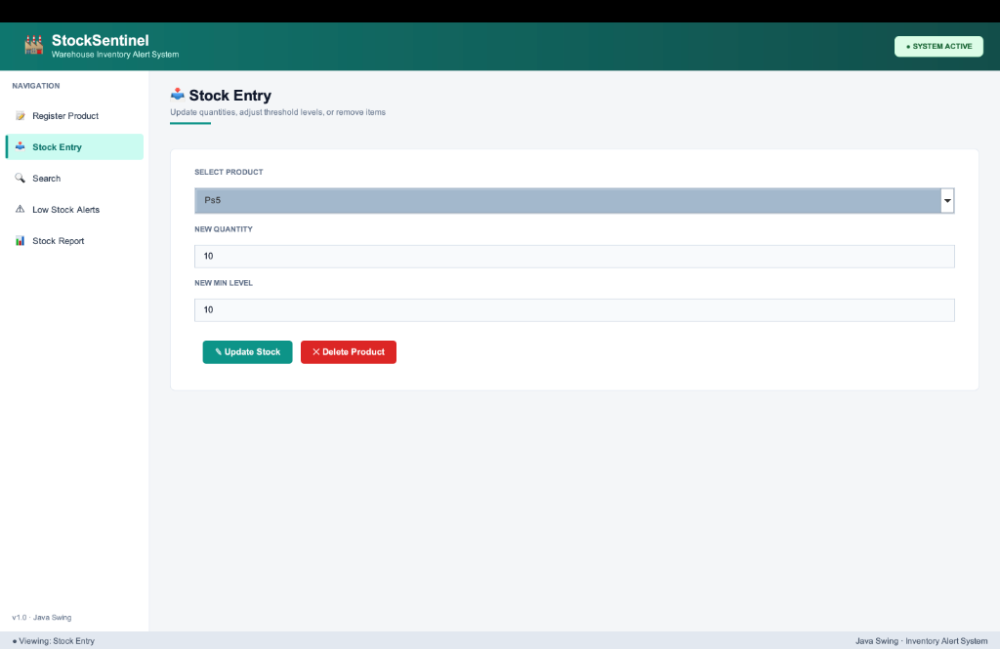
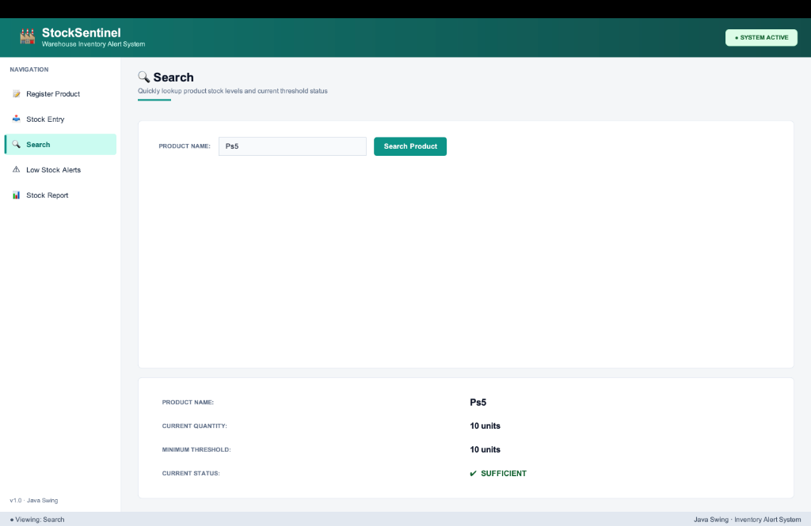
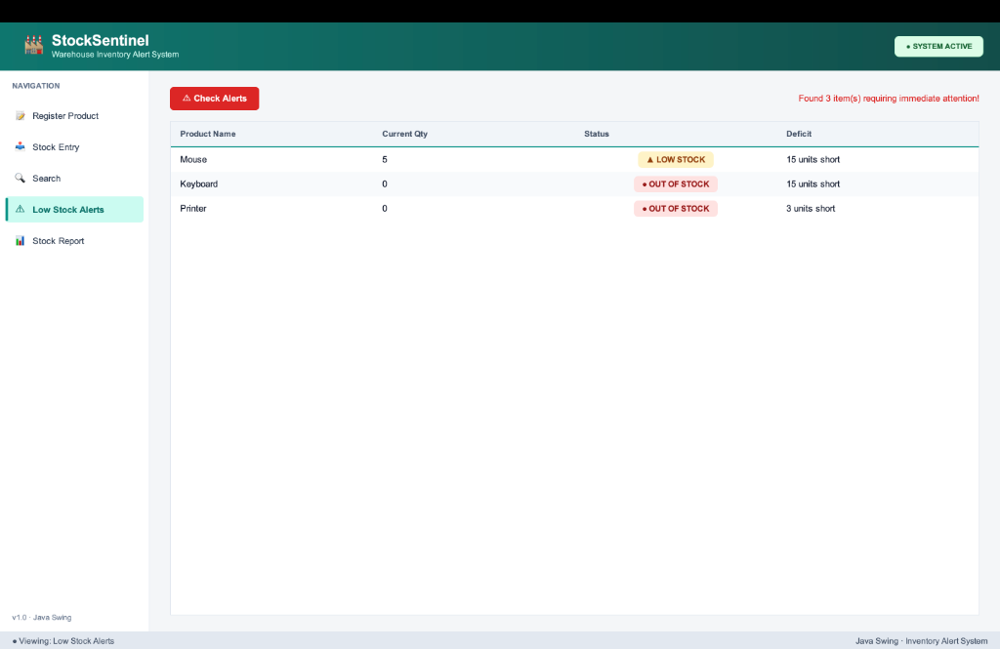
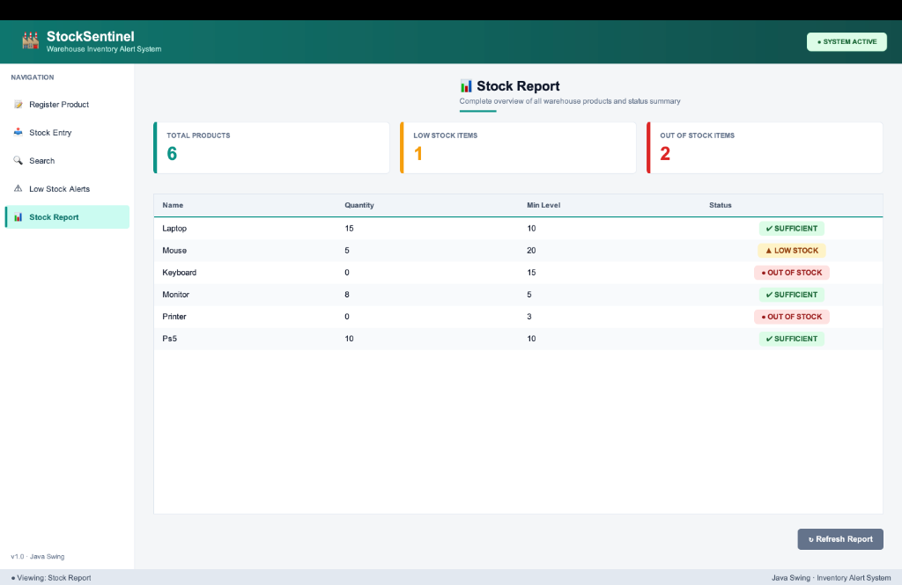

# 🏭 StockSentinel - Warehouse Inventory Stock Alert System

[](https://www.oracle.com/java/)
[](https://docs.oracle.com/javase/8/docs/api/javax/swing/package-summary.html)
[-success?style=for-the-badge)](#)
[](#)

> **StockSentinel** is a desktop inventory monitoring and stock alert system built from scratch using pure Java (Swing + AWT) with **zero external libraries, no Maven, and no Gradle**. It tracks warehouse products, compares quantities against minimum threshold levels, identifies depleted or low-stock items, calculates supply deficits, and alerts warehouse operators in real-time.

---

## 📌 Table of Contents
- [Project Overview](#-project-overview)
- [System Architecture & Java Concepts](#-system-architecture--java-concepts)
- [Key Features](#-key-features)
- [Screenshots & UI Showcase](#-screenshots--ui-showcase)
- [Project Structure](#-project-structure)
- [Getting Started & Installation](#-getting-started--installation)
- [How to Use the Application](#-how-to-use-the-application)
- [Data Model & Verification Logic](#-data-model--verification-logic)
- [License](#-license)

---

## 📖 Project Overview

Warehouses deal with constant movement of goods and need real-time awareness of inventory thresholds. Running out of stock halts shipments, while low stock risks delayed orders. 

**StockSentinel** delivers:
- Storage for product names, quantities, and minimum safe thresholds.
- Direct inventory updates and threshold adjustments.
- Instant automated status classification:
  - **`SUFFICIENT`**: Stock quantity is at or above minimum required levels.
  - **`LOW STOCK`**: Stock quantity is below minimum required levels but greater than zero.
  - **`OUT OF STOCK`**: Stock quantity has dropped to zero.
- Low-stock detection calculating exact deficit units (`minimum - quantity`).
- Interactive desktop dashboard alongside a terminal-based `Scanner` input interface.

---

## 🧠 System Architecture & Java Concepts

This project was built to visibly demonstrate core object-oriented programming concepts using only the Java standard library:

| Mandatory Concept | Implementation Details |
| :--- | :--- |
| **1. Parallel Arrays** | Stores product attributes in four synchronized parallel arrays (`String[] productNames`, `int[] quantities`, `int[] minLevels`, `String[] statuses`) with a fixed capacity limit of `100` and an active `count` pointer. No Collections or `ArrayList` used for core data. |
| **2. Scanner Input** | Encapsulated in `ConsoleInput.java`, allowing terminal-based product entry via `java.util.Scanner` which can be triggered directly from the GUI on a background thread. |
| **3. Iteration & Loops** | `for` loops handle array iteration across analysis, tabular formatting, deficit detection, and array-shifting on product deletion. |
| **4. Conditional Branching** | Multi-branch `if-else` statements compare inventory counts against safety thresholds to categorize item health. |
| **5. Modular Methods** | Every functional requirement is isolated into dedicated, well-documented methods in `InventoryManager.java`. |
| **6. Linear Search** | Case-insensitive linear search algorithm ($O(n)$) returning the target array index or `-1` if not found. |
| **7. Array Element Shifting** | Deleting an item shifts all subsequent elements one index to the left in all parallel arrays and decrements the counter. |

---

## ✨ Key Features

- **🎨 Modern Warehouse Light Theme:** Clean design with custom teal (`#0D9488`) and amber (`#F59E0B`) accents, crisp white cards, and rounded pill badges.
- **⚡ Dual Mode Input:** Primary interactive Swing GUI + terminal-based `Scanner` input mode.
- **📝 Product Registration:** Register new inventory with duplicate name detection and non-negative threshold validation.
- **📥 Stock Entry & Threshold Management:** Update stock count, modify minimum threshold, and view pre-filled values upon product selection.
- **🗑️ Product Deletion with Safety Checks:** Safely remove products with a confirmation dialog and automated array reorganization.
- **🔍 Fast Search:** Case-insensitive product lookup displaying detailed quantity, threshold, and status information.
- **⚠️ Critical Low Stock Alerts:** Immediate scanning of supply deficits with warning popups for critical inventory levels.
- **📊 Real-Time Analytics & Report:** Live KPI metric cards (Total Products, Low Stock Items, Out of Stock Items) and full inventory table with instant refresh.
- **🛡️ Robust Input Validation:** Defensive checks preventing negative values, empty strings, and non-integer inputs using `try-catch` blocks.

---

## 📸 Screenshots & UI Showcase

### 1. Product Registration
Register new items with name and minimum threshold level. Features active border focus indicators and a trigger for console scanner input.



---

### 2. Stock Entry & Management
Select any registered product from the dropdown to auto-fill its current values. Update quantity, adjust minimum safety thresholds, or delete products.



---

### 3. Case-Insensitive Product Search
Search for any item to instantly view its inventory details, safety threshold, and current stock status.



---

### 4. Low Stock Alerts & Deficit Calculation
Dedicated monitoring screen that filters out healthy stock to list only critical items, showing the exact shortage count and color-coded status badges.



---

### 5. Comprehensive Stock Report & KPI Overview
High-level warehouse dashboard featuring 3 KPI cards with colored accent strips and a full tabular report of all products.



---

## 📂 Project Structure

```text
JAVA-PROJECT/
│
├── Main.java              # Application launcher (preloads sample data & starts GUI)
├── InventoryManager.java  # Core business logic & parallel array data structures
├── InventoryGUI.java      # Modern Swing dashboard (CardLayout, custom components)
├── ConsoleInput.java      # Scanner-based console input interface
│
├── screenshots/           # UI screenshots for documentation
│   ├── 01-register-product.png
│   ├── 02-stock-entry.png
│   ├── 03-search-product.png
│   ├── 04-low-stock-alerts.png
│   └── 05-stock-report.png
│
└── README.md              # Project documentation
```

### Class Responsibilities

- **[`Main.java`](Main.java):** Initializes `InventoryManager`, pre-loads 5 sample products (`Laptop`, `Mouse`, `Keyboard`, `Monitor`, `Printer`) with balanced stock states, runs initial diagnostics, and invokes `InventoryGUI` on the Event Dispatch Thread (`SwingUtilities.invokeLater`).
- **[`InventoryManager.java`](InventoryManager.java):** Contains all data structures and business operations. Free of any GUI dependencies for pure separation of concerns.
- **[`InventoryGUI.java`](InventoryGUI.java):** Modern desktop UI built with Swing components (`JFrame`, `CardLayout`, `JTable`, `JComboBox`, `JTextField`) and custom inner classes (`RoundedButton`, `SidebarButton`, `CardPanel`, `SummaryCard`, `StatusBadgeRenderer`).
- **[`ConsoleInput.java`](ConsoleInput.java):** Handles terminal-based input using `Scanner` for entering product names and thresholds.

---

## 🚀 Getting Started & Installation

### Prerequisites
- **Java Development Kit (JDK) 8 or higher** installed.
- Verify your installation by running:
  ```bash
  javac -version
  java -version
  ```

### Build & Run

1. **Clone or Navigate to the Project Directory:**
   ```bash
   cd /path/to/JAVA-PROJECT
   ```

2. **Compile All Source Files:**
   ```bash
   javac *.java
   ```

3. **Launch the Application:**
   ```bash
   java Main
   ```

---

## 🖥️ How to Use the Application

### 1. Register a Product
1. Navigate to **📝 Register Product** in the left sidebar.
2. Enter the **Product Name** and **Minimum Stock Level**.
3. Click **+ Add Product**. The system validates input and prevents duplicates.
4. *(Optional)* Click **Use Console Scanner Input** to enter items via terminal.

### 2. Update Stock or Adjust Thresholds
1. Go to **📥 Stock Entry**.
2. Select a product from the dropdown — the current quantity and minimum level will automatically populate.
3. Modify the quantity or minimum level and click **✎ Update Stock**.
4. To delete a product, select it and click **✕ Delete Product** (requires confirmation).

### 3. Search Inventory
1. Go to **🔍 Search**.
2. Type any product name (e.g., `Laptop`, `ps5`, `printer`) and press **Enter** or click **Search Product**.
3. The result card displays current stock, safety thresholds, and health status.

### 4. Check Alerts
1. Go to **⚠️ Low Stock Alerts**.
2. Click **⚠️ Check Alerts**.
3. The system scans all inventory, displays a notification popup, and lists all low/out-of-stock items alongside their exact deficit shortage.

### 5. View Stock Report
1. Go to **📊 Stock Report**.
2. Review top KPI metrics: **Total Products**, **Low Stock Items**, and **Out of Stock Items**.
3. View the complete tabular overview. Click **↻ Refresh Report** at any time to re-scan.

---

## 📊 Data Model & Verification Logic

The core logic uses parallel arrays initialized with a maximum capacity of 100:

```java
private static final int MAX_SIZE = 100;
private String[] productNames = new String[MAX_SIZE];
private int[]    quantities   = new int[MAX_SIZE];
private int[]    minLevels    = new int[MAX_SIZE];
private String[] statuses     = new String[MAX_SIZE];
private int      count        = 0;
```

### Status Assignment Rule:
$$\text{Status} = \begin{cases} 
\text{"OUT OF STOCK"} & \text{if } \text{quantity} = 0 \\
\text{"LOW STOCK"} & \text{if } \text{quantity} < \text{minimum} \\
\text{"SUFFICIENT"} & \text{if } \text{quantity} \ge \text{minimum} 
\end{cases}$$

### Deficit Calculation:
$$\text{Deficit} = \text{minimum} - \text{quantity}$$

---

## 📄 License

This project is licensed under the **MIT License** — feel free to use, modify, and distribute it for academic or personal projects.
